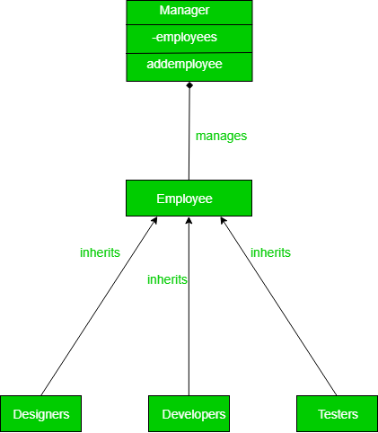

+++
title = "DIP (Dependency Inversion Principle)"
description = "DIP (Dependency Inversion Principle)"
chapter = true
weight = 5
pre = "<b>5. </b>"
+++

## DIP (Dependency Inversion Principle)
---

Инверсия зависимостей говорит о связи между различными классами или модулями (используемый для уменьшения связанности в компьютерных программах).

Основной девиз инверсии зависимостей:
    Любые высшие классы всегда должны зависеть от абстракции класса, а не от деталей.

Это направлено на уменьшение связи между классами, достигается путем введения абстракции между уровнями,
поэтому не заботится о реальной реализации.

#### Формулировка:
- Модули верхних уровней не должны зависеть от модулей нижних уровней. Оба типа модулей должны зависеть от абстракций.
- Абстракции не должны зависеть от деталей. Детали должны зависеть от абстракций.

---

Теперь давайте посмотрим, как будет выглядеть наивный дизайн без инверсии зависимостей:

Создание абстракции между разными сотрудниками и менеджером привело к очень красивому коду проектирования, который легко поддерживать и расширять:

---
#### Read More:
- https://github.com/SanderV1992/SOLID-examples/tree/master/src/dip/good
- https://www.geeksforgeeks.org/dependecy-inversion-principle-solid/
